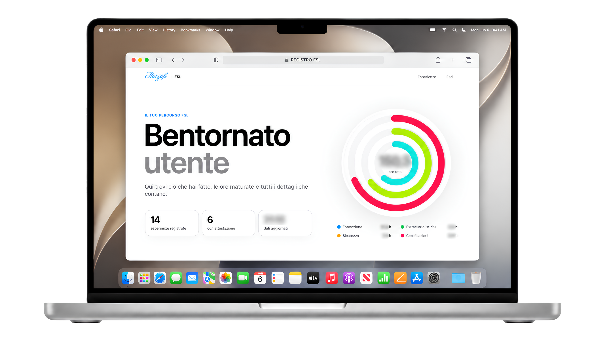

<p align="center">
  
</p>

<h1 align="center">Harzafi FSL</h1>

<p align="center">
  <strong>Ogni esperienza. Un passo avanti.</strong><br>
  Esperienze formative, ore e attestazioni. In un unico spazio digitale.
</p>

<p align="center">
  <a href="#il-progetto"></a>
  <a href="LICENSE.md"></a>
  <a href="#servizi-e-configurazione"></a>
  <a href="#servizi-e-configurazione"></a>
  <a href="#servizi-e-configurazione"></a>
  <a href="#servizi-e-configurazione"></a>
</p>

<p align="center">
  <a href="https://harzafi-fsl.allorasonoadam.chatgpt.site"><strong>Apri il sito</strong></a>
  &nbsp; · &nbsp;
  <a href="#avvio-locale">Inizia in locale</a>
  &nbsp; · &nbsp;
  <a href="#documentazione">Documentazione</a>
  &nbsp; · &nbsp;
  <a href="mailto:harzafi.support@gmail.com">Contattaci</a>
</p>

<p align="center"><sub>L’anteprima ospitata può richiedere l’autorizzazione del proprietario.</sub></p>

<p align="center">
  
</p>

<p align="center"><sub>Immagine di presentazione del progetto, non una schermata live della versione corrente.</sub></p>

---

## Un percorso. Tutto da vedere.

| Le tue esperienze | Il tuo account | Una lettura più semplice |
| :--- | :--- | :--- |
|  |  |  |
| Ore, categorie e attestazioni, con dettagli che si aprono quando servono. | Spiegazioni comprensibili e collegamenti alle informazioni sul trattamento dei dati. | Pagine dedicate, testi leggibili e attenzione alle preferenze di movimento. |
| [Esplora la dashboard](dashboard.html) | [Il tuo account](privacy-account.html) | [Accessibilità](accessibilita.html) |

## Documentazione

Una panoramica per conoscere Harzafi. I dettagli per chi vuole lavorarci.

| Per iniziare | Per approfondire | Per chiedere aiuto |
| --- | --- | --- |
| [Avvio locale](#avvio-locale) | [Configurazione](#servizi-e-configurazione) | [Supporto](mailto:harzafi.support@gmail.com) |
| [Mappa delle pagine](#le-pagine) | [Verifiche e pubblicazione](#verifiche-e-pubblicazione) | [Segnalare una vulnerabilità](SECURITY.md) |
| [Struttura del progetto](#struttura-dei-file) | [Norme sulla privacy](privacy.html) | [Condizioni della licenza](LICENSE.md) |

<details>
<summary><strong>Esplora la guida completa</strong></summary>

- [Il progetto](#il-progetto)
- [Le pagine](#le-pagine)
- [Avvio locale](#avvio-locale)
- [Servizi e configurazione](#servizi-e-configurazione)
- [Struttura dei file](#struttura-dei-file)
- [Verifiche e pubblicazione](#verifiche-e-pubblicazione)
- [Accessibilità e movimento](#accessibilità-e-movimento)
- [Dati e sicurezza](#dati-e-sicurezza)
- [Contributi e contatti](#contributi-e-contatti)
- [Licenza](#licenza)

</details>

## Il progetto

> **Personale. Indipendente. Trasparente.** Harzafi è un progetto personale e indipendente: non è il registro ufficiale dell’istituto e non ne sostituisce gli strumenti. La presenza di un accesso Google non implica l’approvazione della scuola né l’autorizzazione a usare account istituzionali.

Harzafi raccoglie in un’esperienza web la consultazione delle attività formative: riepilogo delle ore, categorie, dettagli espandibili e riferimenti alle attestazioni disponibili.

L’interfaccia è realizzata in HTML, CSS e JavaScript, senza un framework frontend. Firebase è utilizzato per l’autenticazione e per la lettura dei dati. La disponibilità effettiva delle funzioni collegate ai servizi esterni dipende dalla loro configurazione.

Per dimostrazioni e sviluppo, utilizzare esclusivamente account di test e dati fittizi in un ambiente separato. Questo repository non costituisce un’autorizzazione al trattamento di dati scolastici reali.

## Le pagine

| Pagina | Contenuto |
| --- | --- |
| [Home](index.html) | Presentazione del progetto e sezioni informative. |
| [Accesso](login.html) | Accesso all’account e percorsi di recupero. |
| [Dashboard](dashboard.html) | Riepilogo delle ore ed esperienze con dettagli espandibili. |
| [Il tuo account](privacy-account.html) | Spiegazioni semplici sull’account e collegamenti di approfondimento. |
| [Norme sulla privacy](privacy.html) | Informativa sul trattamento dei dati. |
| [Accessibilità](accessibilita.html) | Informazioni e riferimenti dedicati all’accessibilità. |
| [Supporto](supporto.html) | Canali per domande e assistenza. |
| [Termini](termini.html) | Condizioni d’uso del portale. |
| [Reimpostazione password](reset-password.html) | Gestione del collegamento di recupero Firebase. |
| [Pagina non trovata](404.html) | Pagina di errore dedicata. |

“Il tuo account” è una guida introduttiva: non sostituisce l’informativa completa.

## Avvio locale

### Prima di iniziare

Servono Node.js con npm e un browser aggiornato. Usare una versione LTS di Node.js che supporti il test runner integrato; il progetto non dichiara al momento una versione minima nel file `package.json`.

**Prima di provare accessi o recuperi password**, configurare servizi di test: i file del frontend contengono riferimenti a servizi remoti e l’avvio locale non li isola automaticamente.

### Installazione e avvio

Dalla cartella del progetto:

```sh
npm install
npm run dev
```

Aprire [http://localhost:3000](http://localhost:3000). Interrompere il server con `Ctrl+C`.

Il server di sviluppo usa attualmente la porta `3000`, definita in `server.js`. Il valore `PORT` presente in `.env.example` non viene letto automaticamente dal server.

> Il server locale espone la cartella del progetto ed è in ascolto su tutte le interfacce di rete. Usarlo solo per lo sviluppo in un ambiente fidato: non è il server di produzione e non deve contenere segreti o esportazioni di dati.

## Servizi e configurazione

| Componente | Implementazione nel repository | Da configurare separatamente |
| --- | --- | --- |
| Interfaccia | HTML, CSS, JavaScript e risorse in `IMMAGINI/`. | Nessun framework frontend da inizializzare. |
| Autenticazione | Client Firebase Authentication nelle pagine di accesso e dashboard. | Provider, domini autorizzati, account di test e impostazioni della console. |
| Dati | Client Firestore e lettura delle attività in `dashboard.js`. | Database, dati di test e regole di autorizzazione. |
| Accesso Google | Flusso con `GoogleAuthProvider`. | Configurazione OAuth e autorizzazioni del dominio, quando richieste. |
| Controllo anti-bot | Integrazione client Cloudflare Turnstile. | Chiavi, domini e verifica server del token. |
| Email | Chiamate a un Worker esterno da `login.js` e `main.js`. | Servizio di invio, segreti, autorizzazioni e limiti del Worker. |
| Pubblicazione | Build statica con un Worker di instradamento per Sites. | Accesso al progetto di hosting e configurazione dei servizi remoti. |

La configurazione Firebase compare in più file: prima di usare un ambiente di test, individuare tutti i riferimenti e mantenerli coerenti. La configurazione client non sostituisce le regole di accesso al database.

Il repository non include il codice del Worker email né le regole Firestore e Storage. Non è quindi una copia completa dell’infrastruttura remota. Il Worker generato dalla build gestisce gli URL del sito: è distinto dal servizio email.

## Struttura dei file

```text
.
├── index.html, login.html, dashboard.html
├── privacy-account.html, privacy.html, termini.html
├── accessibilita.html, supporto.html
├── reset-password.html, 404.html
├── main.js, login.js, dashboard.js
├── carousel-player.js        # Motore condiviso dei caroselli
├── account-privacy.js        # Comportamento della pagina account
├── site-motion.js            # Animazioni progressive condivise
├── navbar.js                 # Navigazione condivisa
├── *.css                     # Stili generali e delle singole pagine
├── IMMAGINI/                 # Loghi, icone e immagini
├── src/assets/images/        # Ulteriori risorse fotografiche
├── tests/                    # Test dei caroselli e delle animazioni
├── server.js                 # Server di sviluppo Express
├── build-site.js             # Generazione della distribuzione
├── .openai/hosting.json      # Collegamento al progetto Sites
├── .env.example              # Esempio di configurazione
├── package.json              # Dipendenze e comandi
├── README.md                 # Guida al progetto
├── SECURITY.md               # Segnalazioni di sicurezza
└── LICENSE.md                # Testo della licenza in italiano e inglese
```

La cartella `dist/` è generata e ignorata da Git. Modificare i sorgenti, non i file al suo interno.

## Verifiche e pubblicazione

### Controlli disponibili

```sh
npm run lint
node --test tests/carousel-player.test.cjs tests/site-motion.test.cjs
npm run build
```

- `lint` controlla esclusivamente la sintassi di `server.js`: non è un controllo completo di tutto il progetto.
- I test coprono comportamenti dei caroselli e delle animazioni, incluse preferenze di movimento ridotto e navigazione nel carosello.
- La build ricrea `dist/client/` e `dist/server/index.js`. Eseguirla solo dalla copia corretta del progetto: il precedente contenuto di `dist/` viene sostituito.

Questi controlli non verificano le regole Firebase, i servizi esterni, l’intero flusso di autenticazione o la conformità dell’interfaccia.

### Prima di distribuire un aggiornamento

1. Verificare testi, collegamenti e comportamento delle pagine modificate.
2. Provare le funzioni interessate con account e dati di test.
3. Controllare tastiera, schermi piccoli, ingrandimento del testo e preferenze di movimento ridotto.
4. Eseguire i controlli pertinenti e la build.
5. Verificare i file destinati alla pubblicazione: nessun segreto, backup o dato personale deve finire tra le risorse pubbliche.
6. Pubblicare nell’ambiente previsto e controllare l’esito.

La distribuzione Sites è collegata a `.openai/hosting.json`. L’accesso all’anteprima ospitata può essere limitato al proprietario. Pubblicare l’interfaccia non aggiorna automaticamente le impostazioni Firebase o il servizio email.

## Accessibilità e movimento

L’interfaccia include accorgimenti per navigazione da tastiera, focus e riduzione del movimento. Le animazioni condivise rispettano la preferenza `prefers-reduced-motion`; i contenuti non devono dipendere dall’animazione per essere leggibili.

Ogni modifica va controllata nel suo contesto, soprattutto per contrasto, testo ingrandito, ordine del focus, etichette e uso con tecnologie assistive.

Queste scelte progettuali non equivalgono a una certificazione di conformità. Per informazioni e segnalazioni, consultare la [pagina Accessibilità](accessibilita.html).

## Dati e sicurezza

La documentazione distingue ciò che è presente nel codice da ciò che richiede verifiche sull’ambiente remoto.

- Un controllo nel browser o un reindirizzamento dopo il login non sostituisce l’autorizzazione ai dati sul server.
- Non sono documentate qui garanzie di crittografia end-to-end né l’impossibilità di accesso ai dati da parte di chi gestisce i servizi.
- Backup, conservazione e cancellazione sono processi operativi: non vengono implementati o verificati dai test di questo repository.
- Non inserire credenziali, token, esportazioni Firebase o dati di altre persone nel repository, nelle issue o negli allegati pubblici.

Per i dettagli sul trattamento consultare le [Norme sulla privacy](privacy.html). Per un problema tecnico di sicurezza seguire [SECURITY.md](SECURITY.md).

## Contributi e contatti

Per assistenza, proposte o correzioni: [harzafi.support@gmail.com](mailto:harzafi.support@gmail.com).

Una segnalazione utile indica la pagina, il comportamento osservato, quello atteso e i passaggi per riprodurlo. Eventuali schermate devono essere prive di dati personali.

Prima di proporre modifiche, leggere la licenza. Mantenere gli interventi circoscritti, aggiornare la documentazione pertinente e aggiungere verifiche quando cambia un comportamento.

**Una vulnerabilità va segnalata privatamente**, non in una discussione pubblica.

## Licenza

Copyright © 2026 Adam Harzafi.

Il testo applicabile è riportato in [LICENSE.md](LICENSE.md), nelle versioni italiana e inglese. Questa guida non aggiunge divieti o autorizzazioni e non sostituisce le condizioni della licenza.

---

<p align="center">
  <br>
  <strong>Un progetto di Harzafi Adam.</strong><br>
  <sub>Esperienze al centro. Attenzione ai dettagli.</sub>
</p>

<p align="center">
  <a href="mailto:harzafi.support@gmail.com">Supporto</a>
  &nbsp; · &nbsp;
  <a href="SECURITY.md">Sicurezza</a>
  &nbsp; · &nbsp;
  <a href="#harzafi-fsl">Torna all’inizio ↑</a>
</p>
